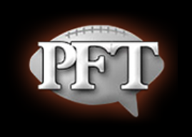

# NBCSports PFT Article Recommender

This project is intended to serve as my Deloitte Machine Learning  Guild (MLG) capstone project during Fall 2020/Spring 2021. The completed project is due NLT March 2021 with the primary code review performed in December 2020.

| Project Role  | Name |
| ------------- | ------------- |
| Apprentice  | [Jeff Weisman](https://github.com/jweisman11a)  |
| Master  | [George Paneteras](https://github.com/GPanoptis)  |

### Project Idea

Website: https://profootballtalk.nbcsports.com/

Football fans know a lot of newsworthy events and stories happen every day, even more so during the season and around playoffs. Most casual fans and even some avid fans don't always have enough time to read through all the articles written every day. To help readers who want to stay up on the latest news and stories about the people and events they care about, I have decided to build an article recommender.

### Data

There are two sources of data for this project: articles and comments

**Articles are comprised of:**
- Title
- URL (unique)
- Author name
- Posted datetime
- Body (unstructured text)
- /# of comments

**Comments are comprised of:**
- Username
- Posted datetime
- Comment
- /# of likes and dislikes

### Collecting existing articles and comments

In order to start the project, I need to confirm I'm able to collect all the articles and comments from the PFT website since the sites inception. According to , Profootballtalk.com was launched in 2001 but the Rumor Mill (which contains the articles I'm interested in) only has articles going back to October 2007.

It appears the Rumor Mill contains ~15 articles/page and at the moment of this writing, has 13,503 pages. That means there are approximately 202,545 articles to collect. Assuming articles average of ~5 comments/article, that means there are approximately 1,012,725 comments to collect.

To test this, I need to complete the following tasks:

- [ ] Write a function to scrape a single article including the 6 elements above
- [ ] Write a function to scrape comments from a single article including the 4 elements above
- [ ] Push code to the repo
- [ ] Submit to MLG pod team members for review and feedback
